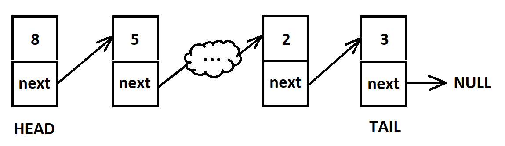
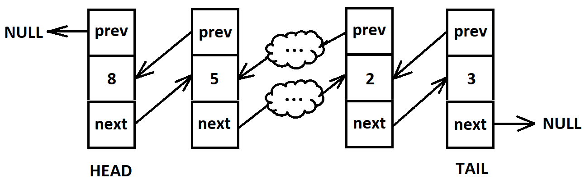

Связный список - это базовая динамическая структура данных, состоящая из узлов, каждый из которых содержит значение и ссылку на следующий узел. Первый элемент списка - Head, последний - Tail, он ссылается на NULL.

Связные списки похожи на массивы, однако добавление и удаление элементов из середины или из начала списка здесь проще, так как нет необходимости менять индексы всех последующих элементов.

Двойной связанный список - это список, в котором узлы содержат ссылки еще и на предыдущий элемент.

Базовым элементом списка является узел (Node) с полями value, next и prev (последнее - для двунаправленного списка).